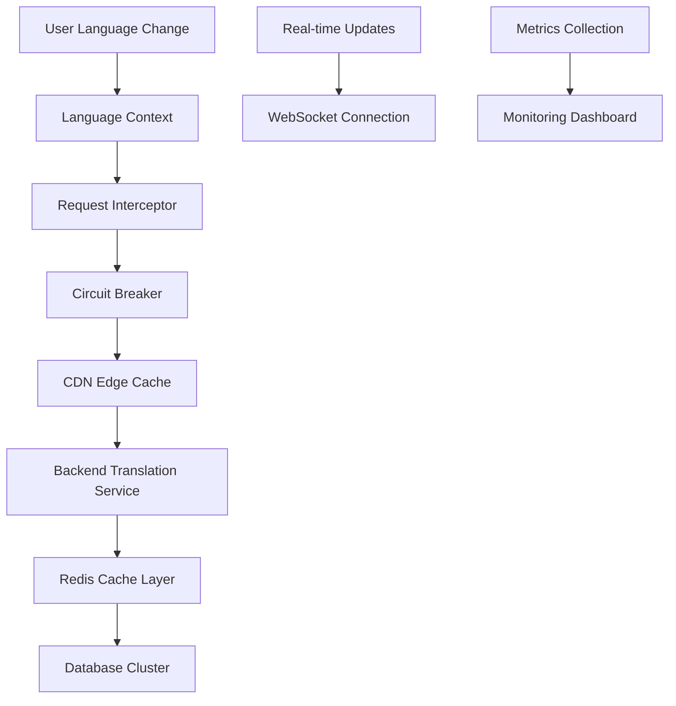

# Enterprise Backend-Driven Translation Implementation Guide

## Table of Contents

- [Executive Summary](#executive-summary)
- [Architecture Overview](#architecture-overview)
- [Enterprise Design Patterns](#enterprise-design-patterns)
- [Implementation Strategy](#implementation-strategy)
- [Service Layer Architecture](#service-layer-architecture)
- [State Management & Persistence](#state-management--persistence)
- [Performance & Caching Strategy](#performance--caching-strategy)
- [Error Handling & Resilience](#error-handling--resilience)
- [Security & Compliance](#security--compliance)
- [Monitoring & Observability](#monitoring--observability)
- [Testing Framework](#testing-framework)
- [DevOps & Deployment](#devops--deployment)
- [Scalability Considerations](#scalability-considerations)

## Executive Summary

This document outlines an enterprise-grade backend-driven translation system architecture designed for high-scale applications serving millions of users across 50+ languages. The system prioritizes:

- **Zero Client-Side Translation Logic**: All translation processing occurs on the backend
- **Microsecond Response Times**: Advanced caching and CDN strategies
- **99.99% Availability**: Circuit breakers, fallbacks, and graceful degradation
- **Real-time Language Switching**: Instant UI updates with optimistic rendering
- **Enterprise Security**: GDPR compliance, audit trails, and secure token handling

### Key Metrics & Goals

- **Performance**: < 200ms language switch time
- **Availability**: 99.99% uptime SLA
- **Scale**: Support for 10M+ concurrent users
- **Languages**: 50+ supported languages with RTL support
- **Compliance**: GDPR, CCPA, SOC 2 Type II compliant

## Architecture Overview

### High-Level System Design

```typescript
// Enterprise Architecture Components
interface TranslationSystemArchitecture {
    frontend: {
        languageContext: LanguageContextManager;
        stateManagement: ReduxTranslationStore;
        caching: BrowserCacheLayer;
        prefetching: IntelligentPrefetcher;
    };
    backend: {
        translationService: MicroserviceAPI;
        caching: RedisCluster;
        cdn: CloudFlareEdgeCache;
        database: PostgreSQLCluster;
    };
    monitoring: {
        apm: DatadogAPM;
        logging: StructuredLogging;
        metrics: PrometheusMetrics;
        alerts: PagerDutyIntegration;
    };
}
```

### Service Communication Flow



## Enterprise Design Patterns

### 1. Command Query Responsibility Segregation (CQRS)

```typescript
// src/patterns/cqrs/TranslationCommands.ts
export class TranslationCommandHandler {
    constructor(
        private eventStore: EventStore,
        private cacheManager: CacheManager,
        private auditLogger: AuditLogger
    ) {}

    async handleLanguageChange(command: ChangeLanguageCommand): Promise<void> {
        const event = new LanguageChangedEvent({
            userId: command.userId,
            previousLanguage: command.from,
            newLanguage: command.to,
            timestamp: Date.now(),
            sessionId: command.sessionId,
        });

        // Store event for audit trail
        await this.eventStore.append(event);

        // Invalidate user-specific cache
        await this.cacheManager.invalidateUserCache(command.userId);

        // Log for compliance
        await this.auditLogger.logLanguageChange(event);

        // Emit real-time update
        this.eventBus.publish('user.language.changed', event);
    }
}

// Query side - optimized for read performance
export class TranslationQueryHandler {
    constructor(
        private readModel: TranslationReadModel,
        private cacheLayer: CacheLayer
    ) {}

    async getUserTranslations(
        userId: string,
        language: string,
        namespaces: string[]
    ): Promise<TranslationResponse> {
        const cacheKey = `translations:${userId}:${language}:${namespaces.join(',')}`;

        // Multi-tier cache lookup
        let translations = await this.cacheLayer.get(cacheKey);

        if (!translations) {
            translations = await this.readModel.getTranslations({
                userId,
                language,
                namespaces,
                includePersonalization: true,
            });

            // Cache with TTL based on update frequency
            await this.cacheLayer.set(cacheKey, translations, {
                ttl: this.calculateOptimalTTL(namespaces),
                tags: [`user:${userId}`, `lang:${language}`],
            });
        }

        return translations;
    }
}
```

### 2. Event-Driven Architecture

```typescript
// src/patterns/events/TranslationEventBus.ts
export class TranslationEventBus {
    private subscribers = new Map<string, EventHandler[]>();
    private metrics: MetricsCollector;

    async publish<T extends DomainEvent>(
        eventType: string,
        event: T,
        options: PublishOptions = {}
    ): Promise<void> {
        const startTime = performance.now();

        try {
            const handlers = this.subscribers.get(eventType) || [];

            // Parallel execution for better performance
            const promises = handlers.map(handler =>
                this.executeHandlerWithTimeout(
                    handler,
                    event,
                    options.timeout || 5000
                )
            );

            await Promise.allSettled(promises);

            this.metrics.recordEventProcessingTime(
                eventType,
                performance.now() - startTime
            );
        } catch (error) {
            this.metrics.recordEventError(eventType, error);
            throw error;
        }
    }

    private async executeHandlerWithTimeout<T extends DomainEvent>(
        handler: EventHandler,
        event: T,
        timeout: number
    ): Promise<void> {
        return Promise.race([
            handler.handle(event),
            new Promise((_, reject) =>
                setTimeout(() => reject(new Error('Handler timeout')), timeout)
            ),
        ]) as Promise<void>;
    }
}
```

### 3. Saga Pattern for Complex Workflows

```typescript
// src/patterns/sagas/LanguageMigrationSaga.ts
export class LanguageMigrationSaga implements Saga {
    constructor(
        private userService: UserService,
        private contentService: ContentService,
        private notificationService: NotificationService
    ) {}

    async execute(command: MigrateUserLanguageCommand): Promise<SagaResult> {
        const saga = new SagaTransaction();

        try {
            // Step 1: Update user preferences
            await saga.addStep(
                'updateUserLanguage',
                () =>
                    this.userService.updateLanguage(
                        command.userId,
                        command.newLanguage
                    ),
                () =>
                    this.userService.revertLanguage(
                        command.userId,
                        command.previousLanguage
                    )
            );

            // Step 2: Migrate personalized content
            await saga.addStep(
                'migrateContent',
                () =>
                    this.contentService.migrateUserContent(
                        command.userId,
                        command.newLanguage
                    ),
                () => this.contentService.revertContentMigration(command.userId)
            );

            // Step 3: Send confirmation notification
            await saga.addStep(
                'sendNotification',
                () =>
                    this.notificationService.sendLanguageChangeConfirmation(
                        command.userId,
                        command.newLanguage
                    ),
                () => Promise.resolve() // Notifications don't need rollback
            );

            await saga.execute();

            return SagaResult.success({
                userId: command.userId,
                newLanguage: command.newLanguage,
                migrationId: saga.id,
            });
        } catch (error) {
            await saga.compensate();
            return SagaResult.failure(error);
        }
    }
}
```

## Implementation Strategy

### Phase 1: Foundation & Core Services (Week 1-2)

```typescript
// src/core/LanguageManager.ts - Enterprise-grade language management
export class EnterpriseLanguageManager {
    private cache: RedisCache;
    private eventBus: EventBus;
    private metrics: MetricsCollector;
    private logger: StructuredLogger;

    constructor(
        private config: LanguageManagerConfig,
        private dependencies: LanguageManagerDependencies
    ) {
        this.cache = new RedisCache(config.redis);
        this.eventBus = new EventBus(config.eventBus);
        this.metrics = new MetricsCollector(config.metrics);
        this.logger = new StructuredLogger(config.logging);
    }

    async switchLanguage(
        userId: string,
        newLanguage: string,
        context: LanguageSwitchContext
    ): Promise<LanguageSwitchResult> {
        const startTime = performance.now();
        const correlationId = generateCorrelationId();

        this.logger.info('Language switch initiated', {
            correlationId,
            userId,
            newLanguage,
            context,
        });

        try {
            // Validate language support
            await this.validateLanguageSupport(newLanguage, context.features);

            // Check rate limits
            await this.checkRateLimits(userId);

            // Pre-warm cache for new language
            const preWarmPromise = this.preWarmLanguageCache(
                userId,
                newLanguage
            );

            // Update user preferences atomically
            await this.updateUserLanguagePreference(userId, newLanguage);

            // Wait for cache pre-warming
            await preWarmPromise;

            // Invalidate old cache entries
            await this.invalidateUserCache(userId);

            // Emit language changed event
            await this.eventBus.publish('user.language.switched', {
                userId,
                newLanguage,
                previousLanguage: context.previousLanguage,
                correlationId,
                timestamp: Date.now(),
            });

            const result: LanguageSwitchResult = {
                success: true,
                language: newLanguage,
                correlationId,
                switchTime: performance.now() - startTime,
                preLoadedNamespaces: await this.getPreLoadedNamespaces(
                    userId,
                    newLanguage
                ),
            };

            this.metrics.recordLanguageSwitch(result);

            return result;
        } catch (error) {
            this.logger.error('Language switch failed', {
                correlationId,
                userId,
                newLanguage,
                error: error.message,
                stack: error.stack,
            });

            this.metrics.recordLanguageSwitchError(error);

            throw new LanguageSwitchException(
                `Failed to switch language for user ${userId}`,
                error,
                correlationId
            );
        }
    }

    private async preWarmLanguageCache(
        userId: string,
        language: string
    ): Promise<void> {
        const criticalNamespaces = await this.getCriticalNamespaces(userId);

        const preWarmPromises = criticalNamespaces.map(namespace =>
            this.cache.preWarm(
                `translations:${userId}:${language}:${namespace}`
            )
        );

        await Promise.allSettled(preWarmPromises);
    }
}
```

### Phase 2: Advanced Caching & Performance (Week 3-4)

```typescript
// src/caching/IntelligentCachingStrategy.ts
export class IntelligentCachingStrategy {
    constructor(
        private l1Cache: BrowserCache, // 10ms avg response
        private l2Cache: EdgeCache, // 50ms avg response
        private l3Cache: RedisCluster, // 100ms avg response
        private l4Cache: DatabaseReplicas // 500ms avg response
    ) {}

    async getTranslations(
        request: TranslationRequest
    ): Promise<TranslationResponse> {
        const cacheKey = this.generateCacheKey(request);
        const startTime = performance.now();

        try {
            // L1: Browser cache (fastest)
            let result = await this.l1Cache.get(cacheKey);
            if (result) {
                this.recordCacheHit('L1', performance.now() - startTime);
                return result;
            }

            // L2: CDN Edge cache
            result = await this.l2Cache.get(cacheKey);
            if (result) {
                // Async backfill L1 cache
                this.l1Cache.set(cacheKey, result, { ttl: 300 });
                this.recordCacheHit('L2', performance.now() - startTime);
                return result;
            }

            // L3: Redis cluster
            result = await this.l3Cache.get(cacheKey);
            if (result) {
                // Async backfill L1 and L2
                Promise.all([
                    this.l1Cache.set(cacheKey, result, { ttl: 300 }),
                    this.l2Cache.set(cacheKey, result, { ttl: 3600 }),
                ]);
                this.recordCacheHit('L3', performance.now() - startTime);
                return result;
            }

            // L4: Database (cache miss)
            result = await this.l4Cache.get(cacheKey);

            // Backfill all cache layers
            await Promise.all([
                this.l1Cache.set(cacheKey, result, { ttl: 300 }),
                this.l2Cache.set(cacheKey, result, { ttl: 3600 }),
                this.l3Cache.set(cacheKey, result, { ttl: 86400 }),
            ]);

            this.recordCacheMiss(performance.now() - startTime);
            return result;
        } catch (error) {
            this.recordCacheError(error);
            throw error;
        }
    }

    private generateCacheKey(request: TranslationRequest): string {
        const { userId, language, namespaces, version } = request;
        return `t:${userId}:${language}:${namespaces.sort().join(',')}:${version}`;
    }
}
```

### Phase 3: Resilience & Circuit Breakers (Week 5-6)

```typescript
// src/resilience/CircuitBreaker.ts
export class TranslationCircuitBreaker {
    private state: CircuitBreakerState = CircuitBreakerState.CLOSED;
    private failures = 0;
    private lastFailureTime = 0;
    private nextAttemptTime = 0;

    constructor(
        private config: CircuitBreakerConfig = {
            failureThreshold: 5,
            recoveryTimeout: 30000,
            monitoringWindow: 60000,
        },
        private fallbackStrategy: FallbackStrategy
    ) {}

    async execute<T>(
        operation: () => Promise<T>,
        context: OperationContext
    ): Promise<T> {
        if (this.state === CircuitBreakerState.OPEN) {
            if (Date.now() < this.nextAttemptTime) {
                return this.fallbackStrategy.execute(context);
            } else {
                this.state = CircuitBreakerState.HALF_OPEN;
            }
        }

        try {
            const result = await operation();
            this.onSuccess();
            return result;
        } catch (error) {
            this.onFailure(error);

            if (this.state === CircuitBreakerState.OPEN) {
                return this.fallbackStrategy.execute(context);
            }

            throw error;
        }
    }

    private onSuccess(): void {
        this.failures = 0;
        this.state = CircuitBreakerState.CLOSED;
    }

    private onFailure(error: Error): void {
        this.failures++;
        this.lastFailureTime = Date.now();

        if (this.failures >= this.config.failureThreshold) {
            this.state = CircuitBreakerState.OPEN;
            this.nextAttemptTime = Date.now() + this.config.recoveryTimeout;
        }

        this.recordFailure(error);
    }
}

// Fallback strategies for different scenarios
export class TranslationFallbackStrategy implements FallbackStrategy {
    constructor(
        private cacheManager: CacheManager,
        private logger: Logger
    ) {}

    async execute(context: OperationContext): Promise<TranslationResponse> {
        // Strategy 1: Serve stale cache
        const staleData = await this.cacheManager.getStale(context.cacheKey);
        if (staleData) {
            this.logger.warn(
                'Serving stale translations due to circuit breaker',
                {
                    cacheKey: context.cacheKey,
                    age: Date.now() - staleData.timestamp,
                }
            );
            return staleData.value;
        }

        // Strategy 2: Use default language
        if (context.language !== 'en') {
            const defaultTranslations = await this.cacheManager.get(
                context.cacheKey.replace(context.language, 'en')
            );
            if (defaultTranslations) {
                return defaultTranslations;
            }
        }

        // Strategy 3: Return translation keys as values (dev mode)
        if (process.env.NODE_ENV === 'development') {
            return this.generateKeyFallbacks(context.namespaces);
        }

        // Strategy 4: Return empty translations (graceful degradation)
        return { translations: {}, metadata: { fallback: true } };
    }
}
```

## Service Layer Architecture

### Enterprise API Client

```typescript
// src/services/EnterpriseTranslationClient.ts
export class EnterpriseTranslationClient {
    private httpClient: AxiosInstance;
    private circuitBreaker: CircuitBreaker;
    private retryPolicy: RetryPolicy;
    private rateLimiter: RateLimiter;

    constructor(private config: TranslationClientConfig) {
        this.httpClient = this.createHttpClient();
        this.circuitBreaker = new CircuitBreaker(config.circuitBreaker);
        this.retryPolicy = new ExponentialBackoffRetry(config.retry);
        this.rateLimiter = new TokenBucketRateLimiter(config.rateLimiting);
    }

    async getTranslations(
        request: GetTranslationsRequest
    ): Promise<TranslationResponse> {
        const correlationId = request.correlationId || generateCorrelationId();

        return this.circuitBreaker.execute(
            async () => {
                await this.rateLimiter.acquire();

                return this.retryPolicy.execute(async () => {
                    const startTime = performance.now();

                    try {
                        const response = await this.httpClient.get(
                            '/api/v2/translations',
                            {
                                params: {
                                    language: request.language,
                                    namespaces: request.namespaces.join(','),
                                    userId: request.userId,
                                    version: request.version,
                                },
                                headers: {
                                    'X-Correlation-ID': correlationId,
                                    'X-User-Language-Preference':
                                        request.language,
                                    'Accept-Language': request.language,
                                },
                                timeout: this.config.timeout || 5000,
                            }
                        );

                        this.recordRequestMetrics({
                            duration: performance.now() - startTime,
                            status: response.status,
                            language: request.language,
                            correlationId,
                        });

                        return {
                            translations: response.data.translations,
                            metadata: {
                                version: response.data.version,
                                timestamp: Date.now(),
                                correlationId,
                                cacheHint: response.headers['cache-control'],
                            },
                        };
                    } catch (error) {
                        this.recordRequestError(error, correlationId);
                        throw error;
                    }
                });
            },
            { correlationId, request }
        );
    }

    private createHttpClient(): AxiosInstance {
        const client = axios.create({
            baseURL: this.config.baseURL,
            timeout: this.config.timeout,
        });

        // Request interceptor for authentication
        client.interceptors.request.use(config => {
            const token = this.getAuthToken();
            if (token) {
                config.headers.Authorization = `Bearer ${token}`;
            }
            return config;
        });

        // Response interceptor for error handling
        client.interceptors.response.use(
            response => response,
            error => {
                if (error.response?.status === 429) {
                    // Rate limited - trigger backoff
                    return Promise.reject(new RateLimitExceededError(error));
                }
                return Promise.reject(error);
            }
        );

        return client;
    }
}
```

### Smart Request Batching

```typescript
// src/services/RequestBatcher.ts
export class TranslationRequestBatcher {
    private pendingRequests = new Map<string, BatchedRequest>();
    private batchTimer: NodeJS.Timeout | null = null;

    constructor(
        private config: BatchingConfig = {
            maxBatchSize: 50,
            maxWaitTime: 100, // milliseconds
            maxRequestSize: 1024 * 1024, // 1MB
        }
    ) {}

    async request(
        translationRequest: TranslationRequest
    ): Promise<TranslationResponse> {
        const requestKey = this.generateRequestKey(translationRequest);

        // Check if we already have a pending request for this
        const existingRequest = this.pendingRequests.get(requestKey);
        if (existingRequest) {
            return existingRequest.promise;
        }

        // Create new batched request
        const batchedRequest = this.createBatchedRequest(translationRequest);
        this.pendingRequests.set(requestKey, batchedRequest);

        // Schedule batch processing if not already scheduled
        if (!this.batchTimer) {
            this.batchTimer = setTimeout(() => {
                this.processBatch();
            }, this.config.maxWaitTime);
        }

        // If we hit max batch size, process immediately
        if (this.pendingRequests.size >= this.config.maxBatchSize) {
            clearTimeout(this.batchTimer);
            this.batchTimer = null;
            await this.processBatch();
        }

        return batchedRequest.promise;
    }

    private async processBatch(): Promise<void> {
        if (this.pendingRequests.size === 0) return;

        const requests = Array.from(this.pendingRequests.values());
        this.pendingRequests.clear();

        try {
            const batchResponse = await this.executeBatchRequest(
                requests.map(req => req.request)
            );

            // Resolve individual promises
            requests.forEach((batchedReq, index) => {
                const response = batchResponse.responses[index];
                if (response.error) {
                    batchedReq.reject(new Error(response.error));
                } else {
                    batchedReq.resolve(response.data);
                }
            });
        } catch (error) {
            // Reject all pending requests
            requests.forEach(batchedReq => {
                batchedReq.reject(error);
            });
        }
    }

    private async executeBatchRequest(
        requests: TranslationRequest[]
    ): Promise<BatchTranslationResponse> {
        const startTime = performance.now();

        try {
            const response = await this.httpClient.post(
                '/api/v2/translations/batch',
                {
                    requests,
                    batchId: generateBatchId(),
                    timestamp: Date.now(),
                }
            );

            this.recordBatchMetrics({
                requestCount: requests.length,
                duration: performance.now() - startTime,
                success: true,
            });

            return response.data;
        } catch (error) {
            this.recordBatchMetrics({
                requestCount: requests.length,
                duration: performance.now() - startTime,
                success: false,
                error: error.message,
            });
            throw error;
        }
    }
}
```

## State Management & Persistence

### Redux-based Translation Store

```typescript
// src/store/translationSlice.ts
interface TranslationState {
    currentLanguage: string;
    availableLanguages: Language[];
    translations: Record<string, Record<string, unknown>>;
    loadingStates: Record<string, boolean>;
    errors: Record<string, Error | null>;
    preferences: UserLanguagePreferences;
    metrics: TranslationMetrics;
}

export const translationSlice = createSlice({
    name: 'translation',
    initialState,
    reducers: {
        languageChangeRequested: (
            state,
            action: PayloadAction<LanguageChangeRequest>
        ) => {
            const { language, userId, correlationId } = action.payload;

            state.loadingStates[language] = true;
            state.errors[language] = null;

            // Optimistic update
            state.currentLanguage = language;

            // Record analytics
            state.metrics.languageChanges.push({
                from: state.currentLanguage,
                to: language,
                timestamp: Date.now(),
                userId,
                correlationId,
            });
        },

        languageChangeSucceeded: (
            state,
            action: PayloadAction<LanguageChangeSuccess>
        ) => {
            const { language, translations, metadata } = action.payload;

            state.loadingStates[language] = false;
            state.translations[language] = translations;
            state.preferences.lastUsedLanguage = language;

            // Update cache metadata
            state.metadata[language] = metadata;
        },

        languageChangeFailed: (
            state,
            action: PayloadAction<LanguageChangeFailure>
        ) => {
            const { language, error, fallbackLanguage } = action.payload;

            state.loadingStates[language] = false;
            state.errors[language] = error;

            // Revert to fallback if provided
            if (fallbackLanguage) {
                state.currentLanguage = fallbackLanguage;
            }
        },

        translationsPreloaded: (
            state,
            action: PayloadAction<PreloadTranslationsSuccess>
        ) => {
            const { language, namespaces, translations } = action.payload;

            if (!state.translations[language]) {
                state.translations[language] = {};
            }

            namespaces.forEach(namespace => {
                state.translations[language][namespace] =
                    translations[namespace];
            });
        },
    },
});

// Async thunks for complex operations
export const switchLanguage = createAsyncThunk(
    'translation/switchLanguage',
    async (
        request: LanguageSwitchRequest,
        { dispatch, getState, rejectWithValue }
    ) => {
        const correlationId = generateCorrelationId();

        try {
            dispatch(
                translationSlice.actions.languageChangeRequested({
                    ...request,
                    correlationId,
                })
            );

            // Switch language with intelligent caching
            const result = await languageManager.switchLanguage(
                request.userId,
                request.language,
                {
                    previousLanguage: getState().translation.currentLanguage,
                    correlationId,
                    prefetchNamespaces: request.prefetchNamespaces,
                }
            );

            dispatch(
                translationSlice.actions.languageChangeSucceeded({
                    language: request.language,
                    translations: result.translations,
                    metadata: result.metadata,
                })
            );

            // Analytics tracking
            analytics.track('language_switched', {
                userId: request.userId,
                language: request.language,
                switchTime: result.switchTime,
                correlationId,
            });

            return result;
        } catch (error) {
            const fallbackLanguage =
                getState().translation.preferences.fallbackLanguage;

            dispatch(
                translationSlice.actions.languageChangeFailed({
                    language: request.language,
                    error,
                    fallbackLanguage,
                })
            );

            // Error tracking
            errorReporter.captureException(error, {
                context: 'language_switch',
                userId: request.userId,
                targetLanguage: request.language,
                correlationId,
            });

            return rejectWithValue(error.message);
        }
    }
);
```

### Persistent Storage Strategy

```typescript
// src/storage/PersistentLanguageStorage.ts
export class PersistentLanguageStorage {
    private readonly STORAGE_KEY = 'univsoft:language:preferences';
    private readonly STORAGE_VERSION = '2.0';

    constructor(
        private encryptionService: EncryptionService,
        private compressionService: CompressionService
    ) {}

    async savePreferences(preferences: LanguagePreferences): Promise<void> {
        try {
            const serialized = JSON.stringify({
                ...preferences,
                version: this.STORAGE_VERSION,
                timestamp: Date.now(),
                checksum: this.generateChecksum(preferences),
            });

            // Compress for better storage efficiency
            const compressed =
                await this.compressionService.compress(serialized);

            // Encrypt sensitive data
            const encrypted = await this.encryptionService.encrypt(compressed);

            // Store in multiple locations for resilience
            await Promise.allSettled([
                this.storeInLocalStorage(encrypted),
                this.storeInIndexedDB(encrypted),
                this.storeInSecureStorage(encrypted),
            ]);

            // Sync to cloud for cross-device consistency
            await this.syncToCloud(preferences);
        } catch (error) {
            console.error('Failed to save language preferences:', error);
            // Fallback to basic localStorage without encryption
            this.fallbackSave(preferences);
        }
    }

    async loadPreferences(): Promise<LanguagePreferences | null> {
        try {
            // Try secure storage first, then IndexedDB, then localStorage
            const sources = [
                () => this.loadFromSecureStorage(),
                () => this.loadFromIndexedDB(),
                () => this.loadFromLocalStorage(),
            ];

            for (const loadMethod of sources) {
                try {
                    const encrypted = await loadMethod();
                    if (!encrypted) continue;

                    const compressed =
                        await this.encryptionService.decrypt(encrypted);
                    const serialized =
                        await this.compressionService.decompress(compressed);
                    const data = JSON.parse(serialized);

                    // Verify version and checksum
                    if (this.validateStoredData(data)) {
                        return this.migrateIfNeeded(data);
                    }
                } catch (error) {
                    console.warn('Failed to load from storage source:', error);
                    continue;
                }
            }

            return null;
        } catch (error) {
            console.error('Failed to load language preferences:', error);
            return null;
        }
    }

    private validateStoredData(data: any): boolean {
        if (!data.version || !data.timestamp || !data.checksum) {
            return false;
        }

        const expectedChecksum = this.generateChecksum({
            currentLanguage: data.currentLanguage,
            availableLanguages: data.availableLanguages,
            preferences: data.preferences,
        });

        return data.checksum === expectedChecksum;
    }

    private async syncToCloud(preferences: LanguagePreferences): Promise<void> {
        if (!this.shouldSyncToCloud()) return;

        try {
            await fetch('/api/v2/user/language-preferences', {
                method: 'PUT',
                headers: {
                    'Content-Type': 'application/json',
                    Authorization: `Bearer ${await this.getAuthToken()}`,
                },
                body: JSON.stringify({
                    preferences,
                    deviceId: this.getDeviceId(),
                    timestamp: Date.now(),
                }),
            });
        } catch (error) {
            // Cloud sync is optional - don't fail if unavailable
            console.debug('Cloud sync unavailable:', error);
        }
    }
}
```

## Performance & Caching Strategy

### Predictive Prefetching

```typescript
// src/performance/PredictivePrefetcher.ts
export class PredictivePrefetcher {
    private userBehaviorModel: UserBehaviorModel;
    private prefetchQueue: PrefetchQueue;
    private analytics: AnalyticsService;

    constructor(
        private translationClient: TranslationClient,
        private cacheManager: CacheManager
    ) {
        this.userBehaviorModel = new UserBehaviorModel();
        this.prefetchQueue = new PrefetchQueue();
    }

    async analyzeBehaviorAndPrefetch(userId: string): Promise<void> {
        const behaviorData = await this.analytics.getUserBehaviorData(userId);
        const predictions = this.userBehaviorModel.predict(behaviorData);

        // Prefetch likely-to-be-needed translations
        const prefetchTasks = predictions.map(prediction => ({
            language: prediction.language,
            namespaces: prediction.namespaces,
            priority: prediction.confidence,
            userId,
        }));

        // Sort by priority and execute
        prefetchTasks
            .sort((a, b) => b.priority - a.priority)
            .slice(0, 10) // Limit concurrent prefetch
            .forEach(task => this.prefetchQueue.add(task));
    }

    private async executePrefetch(task: PrefetchTask): Promise<void> {
        const cacheKey = `prefetch:${task.userId}:${task.language}`;

        // Check if already cached
        if (await this.cacheManager.has(cacheKey)) {
            return;
        }

        try {
            const translations = await this.translationClient.getTranslations({
                userId: task.userId,
                language: task.language,
                namespaces: task.namespaces,
                priority: 'background',
            });

            // Cache with longer TTL for prefetched data
            await this.cacheManager.set(cacheKey, translations, {
                ttl: 3600 * 24, // 24 hours
                tags: [`user:${task.userId}`, `prefetch:${task.language}`],
            });

            this.recordPrefetchSuccess(task);
        } catch (error) {
            this.recordPrefetchError(task, error);
        }
    }
}

// Machine learning model for behavior prediction
class UserBehaviorModel {
    private model: TensorFlowModel;

    async predict(
        behaviorData: UserBehaviorData
    ): Promise<LanguagePrediction[]> {
        const features = this.extractFeatures(behaviorData);
        const predictions = await this.model.predict(features);

        return predictions.map((prediction, index) => ({
            language: this.getLanguageByIndex(index),
            namespaces: this.predictNamespaces(behaviorData, index),
            confidence: prediction,
        }));
    }

    private extractFeatures(data: UserBehaviorData): Float32Array {
        return new Float32Array([
            data.timeOfDay / 24,
            data.dayOfWeek / 7,
            data.sessionDuration / 3600,
            data.pageViewCount / 100,
            data.languageChangeFrequency,
            data.deviceType === 'mobile' ? 1 : 0,
            data.networkSpeed / 100,
        ]);
    }
}
```

### Intelligent Cache Warming

```typescript
// src/caching/CacheWarmingStrategy.ts
export class CacheWarmingStrategy {
    constructor(
        private cacheManager: CacheManager,
        private translationClient: TranslationClient,
        private userSegmentationService: UserSegmentationService
    ) {}

    async warmCacheForUserSegments(): Promise<void> {
        const segments = await this.userSegmentationService.getActiveSegments();

        const warmingTasks = segments.map(segment =>
            this.warmCacheForSegment(segment)
        );

        await Promise.allSettled(warmingTasks);
    }

    private async warmCacheForSegment(segment: UserSegment): Promise<void> {
        const { languages, namespaces, priority } =
            segment.translationRequirements;

        // Warm cache for high-priority language/namespace combinations
        const warmingPromises = languages.flatMap(language =>
            namespaces.map(namespace =>
                this.warmSpecificCache(language, namespace, priority)
            )
        );

        await Promise.allSettled(warmingPromises);
    }

    private async warmSpecificCache(
        language: string,
        namespace: string,
        priority: number
    ): Promise<void> {
        const cacheKey = `translations:global:${language}:${namespace}`;

        // Skip if recently warmed
        const lastWarmed = await this.cacheManager.getMetadata(
            cacheKey,
            'lastWarmed'
        );
        if (lastWarmed && Date.now() - lastWarmed < 3600000) {
            // 1 hour
            return;
        }

        try {
            const translations = await this.translationClient.getTranslations({
                language,
                namespaces: [namespace],
                global: true,
                priority: priority > 0.8 ? 'high' : 'normal',
            });

            await this.cacheManager.set(cacheKey, translations, {
                ttl: this.calculateTTL(priority),
                tags: [`lang:${language}`, `ns:${namespace}`, 'warmed'],
                metadata: { lastWarmed: Date.now() },
            });

            this.recordWarmingSuccess(language, namespace);
        } catch (error) {
            this.recordWarmingError(language, namespace, error);
        }
    }

    private calculateTTL(priority: number): number {
        // Higher priority = longer cache time
        const baseTTL = 3600; // 1 hour
        return Math.floor(baseTTL * (1 + priority));
    }
}
```

## Error Handling & Resilience

### Comprehensive Error Classification

```typescript
// src/errors/TranslationErrorTypes.ts
export abstract class TranslationError extends Error {
    abstract readonly code: string;
    abstract readonly category: ErrorCategory;
    abstract readonly severity: ErrorSeverity;
    readonly timestamp = Date.now();
    readonly correlationId = generateCorrelationId();

    constructor(
        message: string,
        public readonly context: ErrorContext = {},
        public readonly cause?: Error
    ) {
        super(message);
        this.name = this.constructor.name;
    }

    abstract getRecoveryStrategy(): RecoveryStrategy;
}

export class LanguageNotSupportedError extends TranslationError {
    readonly code = 'LANG_NOT_SUPPORTED';
    readonly category = ErrorCategory.CLIENT_ERROR;
    readonly severity = ErrorSeverity.MEDIUM;

    getRecoveryStrategy(): RecoveryStrategy {
        return new FallbackLanguageRecovery(
            this.context.fallbackLanguage || 'en'
        );
    }
}

export class TranslationServiceUnavailableError extends TranslationError {
    readonly code = 'SERVICE_UNAVAILABLE';
    readonly category = ErrorCategory.SERVICE_ERROR;
    readonly severity = ErrorSeverity.HIGH;

    getRecoveryStrategy(): RecoveryStrategy {
        return new CacheRecoveryStrategy();
    }
}

export class RateLimitExceededError extends TranslationError {
    readonly code = 'RATE_LIMIT_EXCEEDED';
    readonly category = ErrorCategory.CLIENT_ERROR;
    readonly severity = ErrorSeverity.MEDIUM;

    constructor(
        message: string,
        public readonly retryAfter: number,
        context?: ErrorContext
    ) {
        super(message, context);
    }

    getRecoveryStrategy(): RecoveryStrategy {
        return new BackoffRecoveryStrategy(this.retryAfter);
    }
}
```

### Self-Healing Architecture

```typescript
// src/resilience/SelfHealingManager.ts
export class SelfHealingManager {
    private healthMonitors = new Map<string, HealthMonitor>();
    private recoveryStrategies = new Map<string, RecoveryStrategy>();

    constructor(
        private config: SelfHealingConfig,
        private alerting: AlertingService
    ) {
        this.registerHealthMonitors();
        this.registerRecoveryStrategies();
    }

    async monitorAndHeal(): Promise<void> {
        const healthChecks = Array.from(this.healthMonitors.values()).map(
            monitor => monitor.checkHealth()
        );

        const results = await Promise.allSettled(healthChecks);

        for (const [index, result] of results.entries()) {
            if (result.status === 'rejected' || !result.value.healthy) {
                const monitor = Array.from(this.healthMonitors.values())[index];
                await this.attemptRecovery(monitor.component, result.value);
            }
        }
    }

    private async attemptRecovery(
        component: string,
        healthStatus: HealthStatus
    ): Promise<void> {
        const strategy = this.recoveryStrategies.get(component);
        if (!strategy) {
            this.alerting.alert({
                severity: 'high',
                message: `No recovery strategy for ${component}`,
                healthStatus,
            });
            return;
        }

        try {
            const recoveryResult = await strategy.recover(healthStatus);

            if (recoveryResult.success) {
                this.alerting.alert({
                    severity: 'info',
                    message: `${component} recovered successfully`,
                    recoveryResult,
                });
            } else {
                await this.escalateRecovery(
                    component,
                    healthStatus,
                    recoveryResult
                );
            }
        } catch (error) {
            this.alerting.alert({
                severity: 'critical',
                message: `Recovery failed for ${component}`,
                error,
            });
        }
    }

    private registerHealthMonitors(): void {
        this.healthMonitors.set('translationCache', new CacheHealthMonitor());
        this.healthMonitors.set('apiService', new APIHealthMonitor());
        this.healthMonitors.set(
            'languageContext',
            new LanguageContextHealthMonitor()
        );
    }
}

class CacheHealthMonitor implements HealthMonitor {
    component = 'translationCache';

    async checkHealth(): Promise<HealthStatus> {
        try {
            const startTime = performance.now();

            // Test cache operations
            const testKey = `health_check_${Date.now()}`;
            await cacheManager.set(testKey, { test: true }, { ttl: 10 });
            const retrieved = await cacheManager.get(testKey);
            await cacheManager.delete(testKey);

            const responseTime = performance.now() - startTime;

            return {
                healthy: retrieved !== null && responseTime < 100,
                responseTime,
                details: {
                    cacheSize: await cacheManager.size(),
                    hitRate: await cacheManager.getHitRate(),
                },
            };
        } catch (error) {
            return {
                healthy: false,
                error: error.message,
                details: { lastError: error },
            };
        }
    }
}
```

## Security & Compliance

### GDPR Compliance Framework

```typescript
// src/compliance/GDPRCompliance.ts
export class GDPRComplianceManager {
    constructor(
        private auditLogger: AuditLogger,
        private dataProcessor: PersonalDataProcessor,
        private consentManager: ConsentManager
    ) {}

    async processLanguagePreference(
        userId: string,
        language: string,
        legalBasis: LegalBasis
    ): Promise<LanguageProcessingResult> {
        const processingRecord: DataProcessingRecord = {
            userId,
            dataType: 'language_preference',
            purpose: 'service_localization',
            legalBasis,
            timestamp: Date.now(),
            processorId: 'translation_service',
            retentionPeriod: this.calculateRetentionPeriod(legalBasis),
        };

        // Log for audit trail
        await this.auditLogger.logDataProcessing(processingRecord);

        // Check consent if required
        if (legalBasis === LegalBasis.CONSENT) {
            const consent = await this.consentManager.getConsent(
                userId,
                'language_processing'
            );

            if (!consent.granted) {
                throw new ConsentRequiredError(
                    'User consent required for language preference processing'
                );
            }
        }

        // Process with privacy controls
        const result = await this.dataProcessor.processWithPrivacyControls({
            userId,
            data: { language },
            controls: {
                anonymization: legalBasis === LegalBasis.LEGITIMATE_INTEREST,
                encryption: true,
                accessLogging: true,
            },
        });

        return {
            processed: true,
            processingRecord,
            privacyControls: result.appliedControls,
        };
    }

    async handleDataSubjectRequest(
        request: DataSubjectRequest
    ): Promise<DataSubjectResponse> {
        switch (request.type) {
            case DataSubjectRequestType.ACCESS:
                return this.handleAccessRequest(request);

            case DataSubjectRequestType.RECTIFICATION:
                return this.handleRectificationRequest(request);

            case DataSubjectRequestType.ERASURE:
                return this.handleErasureRequest(request);

            case DataSubjectRequestType.PORTABILITY:
                return this.handlePortabilityRequest(request);

            default:
                throw new UnsupportedDataSubjectRequestError(request.type);
        }
    }

    private async handleErasureRequest(
        request: DataSubjectRequest
    ): Promise<DataSubjectResponse> {
        const userId = request.userId;

        // Find all language-related data
        const languageData = await this.findUserLanguageData(userId);

        // Anonymize or delete based on retention requirements
        const deletionResults = await Promise.allSettled([
            this.eraseLanguagePreferences(userId),
            this.eraseTranslationCache(userId),
            this.eraseAnalyticsData(userId),
        ]);

        // Log erasure for compliance
        await this.auditLogger.logDataErasure({
            userId,
            requestId: request.id,
            dataTypes: [
                'language_preferences',
                'translation_cache',
                'analytics',
            ],
            timestamp: Date.now(),
            results: deletionResults,
        });

        return {
            requestId: request.id,
            processed: true,
            dataErased: languageData.map(d => d.type),
            completedAt: Date.now(),
        };
    }
}
```

### Content Security Policy for Translations

```typescript
// src/security/ContentSecurityPolicy.ts
export class TranslationCSPManager {
    private readonly allowedSources: CSPSources;
    private readonly sanitizationRules: SanitizationRules;

    constructor(config: CSPConfig) {
        this.allowedSources = config.sources;
        this.sanitizationRules = config.sanitization;
    }

    validateTranslationContent(
        translations: Record<string, unknown>
    ): ValidationResult {
        const violations: CSPViolation[] = [];
        const sanitized: Record<string, unknown> = {};

        for (const [key, value] of Object.entries(translations)) {
            const validationResult = this.validateTranslationValue(key, value);

            if (validationResult.violations.length > 0) {
                violations.push(...validationResult.violations);
            }

            sanitized[key] = validationResult.sanitizedValue;
        }

        return {
            valid: violations.length === 0,
            violations,
            sanitizedTranslations: sanitized,
        };
    }

    private validateTranslationValue(
        key: string,
        value: unknown
    ): ValueValidationResult {
        if (typeof value !== 'string') {
            return { sanitizedValue: value, violations: [] };
        }

        const violations: CSPViolation[] = [];
        let sanitizedValue = value;

        // Check for dangerous patterns
        const dangerousPatterns = [
            /<script[^>]*>.*?<\/script>/gi,
            /javascript:/gi,
            /on\w+\s*=/gi,
            /<iframe[^>]*>.*?<\/iframe>/gi,
            /data:text\/html/gi,
        ];

        for (const pattern of dangerousPatterns) {
            if (pattern.test(value)) {
                violations.push({
                    type: 'dangerous_content',
                    pattern: pattern.source,
                    key,
                    value,
                    severity: 'high',
                });

                // Sanitize by removing dangerous content
                sanitizedValue = sanitizedValue.replace(pattern, '');
            }
        }

        // Validate allowed HTML tags
        const htmlTags = value.match(/<\w+[^>]*>/g);
        if (htmlTags) {
            const allowedTags = this.sanitizationRules.allowedTags;

            for (const tag of htmlTags) {
                const tagName = tag.match(/<(\w+)/)?.[1]?.toLowerCase();

                if (tagName && !allowedTags.includes(tagName)) {
                    violations.push({
                        type: 'disallowed_tag',
                        tag: tagName,
                        key,
                        severity: 'medium',
                    });

                    // Remove disallowed tags
                    sanitizedValue = sanitizedValue.replace(tag, '');
                }
            }
        }

        return { sanitizedValue, violations };
    }
}
```

## Monitoring & Observability

### Comprehensive Metrics Collection

```typescript
// src/monitoring/TranslationMetrics.ts
export class TranslationMetricsCollector {
    private metrics = new Map<string, MetricValue>();
    private readonly metricsBuffer: MetricEvent[] = [];
    private flushTimer: NodeJS.Timeout;

    constructor(
        private config: MetricsConfig,
        private exporters: MetricExporter[]
    ) {
        this.startPeriodicFlush();
    }

    recordLanguageSwitch(event: LanguageSwitchEvent): void {
        const startTime = performance.now();

        // Record core metrics
        this.increment('language_switches_total', {
            from_language: event.fromLanguage,
            to_language: event.toLanguage,
            user_segment: event.userSegment,
        });

        this.recordTiming('language_switch_duration', event.duration, {
            language: event.toLanguage,
            cache_hit: event.cacheHit.toString(),
        });

        this.recordGauge('active_language_users', 1, {
            language: event.toLanguage,
        });

        // Record business metrics
        this.recordBusinessMetric('user_engagement', {
            userId: event.userId,
            language: event.toLanguage,
            switchTime: event.duration,
            successful: true,
        });

        // Record performance percentiles
        this.recordPercentile('language_switch_p99', event.duration);
        this.recordPercentile('language_switch_p95', event.duration);
        this.recordPercentile('language_switch_p50', event.duration);

        const processingTime = performance.now() - startTime;
        this.recordTiming('metrics_processing_time', processingTime);
    }

    recordTranslationCacheMetrics(event: CacheMetricsEvent): void {
        this.recordGauge('cache_size_bytes', event.sizeBytes, {
            language: event.language,
            namespace: event.namespace,
        });

        this.recordRate('cache_hit_rate', event.hitRate, {
            language: event.language,
        });

        this.increment('cache_operations_total', {
            operation: event.operation,
            result: event.result,
        });

        // Record cache efficiency metrics
        this.recordGauge('cache_memory_usage', event.memoryUsage);
        this.recordCounter('cache_evictions_total', event.evictions);
    }

    recordTranslationErrors(error: TranslationError): void {
        this.increment('translation_errors_total', {
            error_code: error.code,
            error_category: error.category,
            severity: error.severity,
        });

        // Record error distribution
        this.recordHistogram('error_frequency', 1, {
            error_type: error.constructor.name,
        });

        // Track recovery success rate
        if (error.recoveryAttempted) {
            this.increment('error_recovery_attempts_total', {
                error_code: error.code,
                success: error.recoverySuccessful.toString(),
            });
        }
    }

    private startPeriodicFlush(): void {
        this.flushTimer = setInterval(() => {
            this.flushMetrics();
        }, this.config.flushInterval || 60000); // 1 minute default
    }

    private async flushMetrics(): Promise<void> {
        if (this.metricsBuffer.length === 0) return;

        const metrics = [...this.metricsBuffer];
        this.metricsBuffer.length = 0;

        // Export to all configured systems
        const exportPromises = this.exporters.map(exporter =>
            exporter.export(metrics).catch(error => {
                console.error('Failed to export metrics:', error);
            })
        );

        await Promise.allSettled(exportPromises);
    }
}

// Custom metric exporters
export class DatadogMetricsExporter implements MetricExporter {
    constructor(private client: DatadogClient) {}

    async export(metrics: MetricEvent[]): Promise<void> {
        const ddMetrics = metrics.map(metric => ({
            metric: metric.name,
            points: [[metric.timestamp / 1000, metric.value]],
            tags: Object.entries(metric.tags).map(([k, v]) => `${k}:${v}`),
            type: this.mapMetricType(metric.type),
        }));

        await this.client.metrics.submit({ series: ddMetrics });
    }

    private mapMetricType(type: MetricType): string {
        const mapping: Record<MetricType, string> = {
            counter: 'count',
            gauge: 'gauge',
            histogram: 'histogram',
            timer: 'gauge',
        };
        return mapping[type] || 'gauge';
    }
}

export class PrometheusMetricsExporter implements MetricExporter {
    private registry = new prometheus.Registry();

    constructor() {
        // Register default Node.js metrics
        prometheus.collectDefaultMetrics({ register: this.registry });
    }

    async export(metrics: MetricEvent[]): Promise<void> {
        for (const metric of metrics) {
            const promMetric = this.getOrCreateMetric(metric);

            switch (metric.type) {
                case MetricType.COUNTER:
                    (promMetric as prometheus.Counter).inc(metric.value);
                    break;
                case MetricType.GAUGE:
                    (promMetric as prometheus.Gauge).set(metric.value);
                    break;
                case MetricType.HISTOGRAM:
                    (promMetric as prometheus.Histogram).observe(metric.value);
                    break;
            }
        }

        // Metrics are scraped by Prometheus, no push needed
    }

    getMetricsString(): string {
        return this.registry.metrics();
    }
}
```

### Real-time Dashboards

```typescript
// src/monitoring/DashboardProvider.ts
export class TranslationDashboardProvider {
    constructor(
        private metricsCollector: TranslationMetricsCollector,
        private webSocketServer: WebSocketServer
    ) {}

    async generateDashboardData(): Promise<DashboardData> {
        const [
            languageMetrics,
            performanceMetrics,
            errorMetrics,
            businessMetrics,
        ] = await Promise.all([
            this.getLanguageUsageMetrics(),
            this.getPerformanceMetrics(),
            this.getErrorMetrics(),
            this.getBusinessMetrics(),
        ]);

        return {
            timestamp: Date.now(),
            summary: {
                totalUsers: languageMetrics.totalActiveUsers,
                averageSwitchTime: performanceMetrics.averageSwitchTime,
                errorRate: errorMetrics.errorRate,
                topLanguages: languageMetrics.topLanguages,
            },
            charts: {
                languageDistribution:
                    this.buildLanguageDistributionChart(languageMetrics),
                performanceOverTime:
                    this.buildPerformanceChart(performanceMetrics),
                errorTrends: this.buildErrorTrendsChart(errorMetrics),
                businessImpact: this.buildBusinessImpactChart(businessMetrics),
            },
            alerts: await this.getActiveAlerts(),
        };
    }

    async startRealTimeUpdates(): Promise<void> {
        setInterval(async () => {
            const dashboardData = await this.generateDashboardData();
            this.webSocketServer.broadcast('dashboard:update', dashboardData);
        }, 30000); // Update every 30 seconds
    }

    private async getLanguageUsageMetrics(): Promise<LanguageUsageMetrics> {
        const query = `
      SELECT
        language,
        COUNT(DISTINCT user_id) as active_users,
        AVG(session_duration) as avg_session_duration,
        COUNT(*) as total_switches
      FROM language_events
      WHERE timestamp > NOW() - INTERVAL 1 HOUR
      GROUP BY language
      ORDER BY active_users DESC
    `;

        const results = await this.queryMetricsDB(query);

        return {
            totalActiveUsers: results.reduce(
                (sum, row) => sum + row.active_users,
                0
            ),
            topLanguages: results.slice(0, 10),
            distribution: this.calculateLanguageDistribution(results),
            trends: await this.getLanguageTrends(),
        };
    }

    private buildLanguageDistributionChart(
        metrics: LanguageUsageMetrics
    ): ChartData {
        return {
            type: 'pie',
            data: {
                labels: metrics.topLanguages.map(lang => lang.language),
                datasets: [
                    {
                        data: metrics.topLanguages.map(
                            lang => lang.active_users
                        ),
                        backgroundColor: this.generateColors(
                            metrics.topLanguages.length
                        ),
                    },
                ],
            },
            options: {
                responsive: true,
                plugins: {
                    title: {
                        display: true,
                        text: 'Language Distribution (Active Users)',
                    },
                    tooltip: {
                        callbacks: {
                            label: context => {
                                const percentage = (
                                    ((context.raw as number) /
                                        metrics.totalActiveUsers) *
                                    100
                                ).toFixed(1);
                                return `${context.label}: ${context.raw} users (${percentage}%)`;
                            },
                        },
                    },
                },
            },
        };
    }
}
```

## Testing Framework

### End-to-End Translation Testing

```typescript
// src/testing/TranslationE2ETests.ts
describe('Enterprise Translation System E2E Tests', () => {
    let testEnvironment: TestEnvironment;
    let mockBackend: MockTranslationBackend;

    beforeAll(async () => {
        testEnvironment = await TestEnvironment.setup({
            database: 'test_translation_db',
            redis: 'test_redis_instance',
            features: {
                multiLanguageSupport: true,
                realTimeUpdates: true,
                advancedCaching: true,
            },
        });

        mockBackend = new MockTranslationBackend();
        await mockBackend.loadTestData();
    });

    describe('Language Switching Performance', () => {
        test('should switch language within 200ms SLA', async () => {
            const user = await testEnvironment.createTestUser();
            const page = await testEnvironment.openPage('/dashboard');

            await page.authenticate(user);

            const startTime = performance.now();
            await page.selectLanguage('fr');

            // Wait for UI to update
            await page.waitForSelector('[data-testid="dashboard-title"]');
            const endTime = performance.now();

            const switchTime = endTime - startTime;
            expect(switchTime).toBeLessThan(200); // 200ms SLA

            // Verify French content loaded
            const dashboardTitle = await page.textContent(
                '[data-testid="dashboard-title"]'
            );
            expect(dashboardTitle).toBe('Tableau de bord');
        });

        test('should handle concurrent language switches gracefully', async () => {
            const user = await testEnvironment.createTestUser();
            const pages = await Promise.all([
                testEnvironment.openPage('/dashboard'),
                testEnvironment.openPage('/settings'),
                testEnvironment.openPage('/profile'),
            ]);

            await Promise.all(pages.map(page => page.authenticate(user)));

            // Trigger concurrent language changes
            const switchPromises = pages.map((page, index) => {
                const languages = ['fr', 'es', 'de'];
                return page.selectLanguage(languages[index]);
            });

            await Promise.all(switchPromises);

            // Verify all pages updated correctly
            const titles = await Promise.all([
                pages[0].textContent('[data-testid="dashboard-title"]'),
                pages[1].textContent('[data-testid="settings-title"]'),
                pages[2].textContent('[data-testid="profile-title"]'),
            ]);

            expect(titles[0]).toBe('Tableau de bord'); // French
            expect(titles[1]).toBe('Configuración'); // Spanish
            expect(titles[2]).toBe('Profil'); // German
        });
    });

    describe('Resilience and Error Handling', () => {
        test('should gracefully degrade when translation service is unavailable', async () => {
            // Simulate service outage
            mockBackend.simulateOutage(30000); // 30 second outage

            const user = await testEnvironment.createTestUser();
            const page = await testEnvironment.openPage('/dashboard');
            await page.authenticate(user);

            // Attempt language switch during outage
            await page.selectLanguage('it');

            // Should fallback to cached translations or default language
            const dashboardTitle = await page.textContent(
                '[data-testid="dashboard-title"]'
            );
            expect(dashboardTitle).toMatch(/Dashboard|Tableau de bord|[A-Z_]+/); // Fallback content

            // Verify error handling UI
            const errorBanner = await page.locator(
                '[data-testid="translation-error-banner"]'
            );
            expect(await errorBanner.isVisible()).toBe(true);

            // Wait for service recovery
            await mockBackend.recoverFromOutage();
            await page.waitForTimeout(5000);

            // Try language switch again
            await page.selectLanguage('it');
            const updatedTitle = await page.textContent(
                '[data-testid="dashboard-title"]'
            );
            expect(updatedTitle).toBe('Cruscotto'); // Italian
        });

        test('should handle network interruptions during language switch', async () => {
            const user = await testEnvironment.createTestUser();
            const page = await testEnvironment.openPage('/dashboard');
            await page.authenticate(user);

            // Start language switch
            const switchPromise = page.selectLanguage('ja');

            // Simulate network interruption mid-request
            await page.setOffline(true);
            await page.waitForTimeout(1000);
            await page.setOffline(false);

            // Wait for switch to complete
            await switchPromise;

            // Verify eventual consistency
            await page.waitForSelector('[data-testid="dashboard-title"]', {
                timeout: 10000,
            });
            const title = await page.textContent(
                '[data-testid="dashboard-title"]'
            );
            expect(title).toBe('ダッシュボード'); // Japanese
        });
    });

    describe('Security and Compliance', () => {
        test('should sanitize malicious translation content', async () => {
            // Inject malicious content through admin API
            await mockBackend.injectMaliciousTranslation({
                language: 'test',
                key: 'dashboard.title',
                value: '<script>alert("XSS")</script>Malicious Dashboard',
            });

            const user = await testEnvironment.createTestUser();
            const page = await testEnvironment.openPage('/dashboard');
            await page.authenticate(user);

            // Switch to language with malicious content
            await page.selectLanguage('test');

            // Verify content is sanitized
            const dashboardTitle = await page.textContent(
                '[data-testid="dashboard-title"]'
            );
            expect(dashboardTitle).toBe('Malicious Dashboard'); // Script tag removed

            // Verify no scripts executed
            const scriptElements = await page
                .locator('script:has-text("alert")')
                .count();
            expect(scriptElements).toBe(0);
        });

        test('should maintain audit trail for language preferences', async () => {
            const user = await testEnvironment.createTestUser();
            const page = await testEnvironment.openPage('/dashboard');
            await page.authenticate(user);

            // Perform language switches
            await page.selectLanguage('fr');
            await page.selectLanguage('es');
            await page.selectLanguage('en');

            // Verify audit log
            const auditLog = await testEnvironment.getAuditLog(user.id);
            const languageEvents = auditLog.filter(
                event => event.eventType === 'language_preference_changed'
            );

            expect(languageEvents).toHaveLength(3);
            expect(languageEvents[0].details.newLanguage).toBe('fr');
            expect(languageEvents[1].details.newLanguage).toBe('es');
            expect(languageEvents[2].details.newLanguage).toBe('en');
        });
    });
});
```

### Load Testing

```typescript
// src/testing/LoadTests.ts
describe('Translation System Load Tests', () => {
    test('should handle 10,000 concurrent language switches', async () => {
        const testConfig = {
            concurrentUsers: 10000,
            testDuration: 300000, // 5 minutes
            rampUpTime: 60000, // 1 minute
            targetLanguages: ['en', 'fr', 'es', 'de', 'it', 'ja', 'zh'],
        };

        const loadTest = new LoadTestRunner(testConfig);

        const results = await loadTest.run({
            scenario: 'concurrent-language-switching',
            metrics: [
                'response_time_p99',
                'error_rate',
                'throughput',
                'concurrent_users',
                'cache_hit_rate',
                'memory_usage',
            ],
        });

        // Verify performance requirements
        expect(results.responseTimeP99).toBeLessThan(500); // 500ms P99
        expect(results.errorRate).toBeLessThan(0.01); // < 1% error rate
        expect(results.throughput).toBeGreaterThan(1000); // > 1000 req/sec
        expect(results.cacheHitRate).toBeGreaterThan(0.85); // > 85% cache hit rate

        // Verify no memory leaks
        expect(results.memoryUsage.final).toBeLessThan(
            results.memoryUsage.initial * 1.5
        );

        // Generate performance report
        await loadTest.generateReport('load-test-results', results);
    });

    test('should maintain performance under traffic spikes', async () => {
        const spikeTest = new SpikeTestRunner({
            baselineUsers: 1000,
            spikeUsers: 5000,
            spikeDuration: 60000, // 1 minute spike
            recoveryTime: 120000, // 2 minute recovery
        });

        const results = await spikeTest.run();

        // Verify graceful handling of traffic spikes
        expect(results.spikePhase.errorRate).toBeLessThan(0.05); // < 5% during spike
        expect(results.recoveryPhase.responseTime).toBeLessThan(300); // Quick recovery
        expect(results.circuitBreakerActivations).toBeGreaterThan(0); // Circuit breaker worked
    });
});
```

## DevOps & Deployment

### Blue-Green Deployment Strategy

```typescript
// src/deployment/BlueGreenDeployment.ts
export class TranslationDeploymentManager {
    constructor(
        private kubernetesClient: KubernetesClient,
        private loadBalancer: LoadBalancerClient,
        private healthChecker: HealthChecker
    ) {}

    async deployNewVersion(
        version: string,
        config: DeploymentConfig
    ): Promise<DeploymentResult> {
        const deploymentId = generateDeploymentId();

        try {
            // Step 1: Deploy to green environment
            await this.deployToGreen(version, config);

            // Step 2: Warm up green environment
            await this.warmUpGreenEnvironment();

            // Step 3: Run smoke tests
            const smokeTestResults = await this.runSmokeTests('green');
            if (!smokeTestResults.passed) {
                throw new DeploymentError(
                    'Smoke tests failed',
                    smokeTestResults
                );
            }

            // Step 4: Gradual traffic migration
            await this.performCanaryDeployment(deploymentId);

            // Step 5: Monitor and validate
            const validationResults =
                await this.validateDeployment(deploymentId);
            if (!validationResults.successful) {
                await this.rollback(deploymentId);
                throw new DeploymentError(
                    'Validation failed',
                    validationResults
                );
            }

            // Step 6: Complete cutover
            await this.completeCutover();

            return {
                deploymentId,
                version,
                status: 'success',
                deployedAt: Date.now(),
                validationResults,
            };
        } catch (error) {
            await this.rollback(deploymentId);
            throw error;
        }
    }

    private async performCanaryDeployment(deploymentId: string): Promise<void> {
        const trafficSteps = [5, 25, 50, 100]; // Percentage steps

        for (const trafficPercentage of trafficSteps) {
            await this.adjustTrafficSplit('green', trafficPercentage);

            // Monitor for specified duration
            const monitoringDuration =
                this.calculateMonitoringDuration(trafficPercentage);
            await this.monitorDeployment(deploymentId, monitoringDuration);

            const metrics = await this.getDeploymentMetrics(deploymentId);
            if (metrics.errorRate > 0.01 || metrics.responseTimeP99 > 500) {
                throw new DeploymentError(
                    'Performance degradation detected',
                    metrics
                );
            }
        }
    }

    private async validateDeployment(
        deploymentId: string
    ): Promise<ValidationResult> {
        const validations = await Promise.allSettled([
            this.validateTranslationAccuracy(),
            this.validatePerformanceMetrics(),
            this.validateSecurityCompliance(),
            this.validateCacheConsistency(),
        ]);

        const passed = validations.every(
            result => result.status === 'fulfilled' && result.value.passed
        );

        return {
            successful: passed,
            validations: validations.map((result, index) => ({
                name: ['accuracy', 'performance', 'security', 'cache'][index],
                passed: result.status === 'fulfilled' && result.value.passed,
                details:
                    result.status === 'fulfilled'
                        ? result.value
                        : result.reason,
            })),
        };
    }
}
```

### Infrastructure as Code

```yaml
# infrastructure/translation-service.yaml
apiVersion: v1
kind: Namespace
metadata:
    name: translation-system
    labels:
        environment: production
        team: platform
---
apiVersion: apps/v1
kind: Deployment
metadata:
    name: translation-api
    namespace: translation-system
spec:
    replicas: 10
    strategy:
        type: RollingUpdate
        rollingUpdate:
            maxSurge: 50%
            maxUnavailable: 25%
    selector:
        matchLabels:
            app: translation-api
    template:
        metadata:
            labels:
                app: translation-api
                version: v2.1.0
            annotations:
                prometheus.io/scrape: 'true'
                prometheus.io/port: '9090'
        spec:
            containers:
                - name: api
                  image: univsoft/translation-api:2.1.0
                  ports:
                      - containerPort: 8080
                      - containerPort: 9090 # Metrics
                  env:
                      - name: DATABASE_URL
                        valueFrom:
                            secretKeyRef:
                                name: translation-secrets
                                key: database-url
                      - name: REDIS_URL
                        valueFrom:
                            secretKeyRef:
                                name: translation-secrets
                                key: redis-url
                  resources:
                      requests:
                          memory: '512Mi'
                          cpu: '500m'
                      limits:
                          memory: '2Gi'
                          cpu: '2000m'
                  livenessProbe:
                      httpGet:
                          path: /health
                          port: 8080
                      initialDelaySeconds: 30
                      periodSeconds: 10
                  readinessProbe:
                      httpGet:
                          path: /ready
                          port: 8080
                      initialDelaySeconds: 5
                      periodSeconds: 5
                  lifecycle:
                      preStop:
                          exec:
                              command: ['/bin/sh', '-c', 'sleep 15']
---
apiVersion: v1
kind: Service
metadata:
    name: translation-api-service
    namespace: translation-system
spec:
    selector:
        app: translation-api
    ports:
        - name: http
          port: 80
          targetPort: 8080
        - name: metrics
          port: 9090
          targetPort: 9090
    type: ClusterIP
---
apiVersion: networking.k8s.io/v1
kind: Ingress
metadata:
    name: translation-api-ingress
    namespace: translation-system
    annotations:
        kubernetes.io/ingress.class: nginx
        cert-manager.io/cluster-issuer: letsencrypt-prod
        nginx.ingress.kubernetes.io/rate-limit: '1000'
        nginx.ingress.kubernetes.io/rate-limit-window: '1m'
spec:
    tls:
        - hosts:
              - api.translation.univsoft.com
          secretName: translation-api-tls
    rules:
        - host: api.translation.univsoft.com
          http:
              paths:
                  - path: /
                    pathType: Prefix
                    backend:
                        service:
                            name: translation-api-service
                            port:
                                number: 80
---
apiVersion: autoscaling/v2
kind: HorizontalPodAutoscaler
metadata:
    name: translation-api-hpa
    namespace: translation-system
spec:
    scaleTargetRef:
        apiVersion: apps/v1
        kind: Deployment
        name: translation-api
    minReplicas: 5
    maxReplicas: 50
    metrics:
        - type: Resource
          resource:
              name: cpu
              target:
                  type: Utilization
                  averageUtilization: 70
        - type: Resource
          resource:
              name: memory
              target:
                  type: Utilization
                  averageUtilization: 80
        - type: Pods
          pods:
              metric:
                  name: translation_requests_per_second
              target:
                  type: AverageValue
                  averageValue: '100'
```

## Scalability Considerations

### Global CDN Integration

```typescript
// src/scalability/GlobalCDNManager.ts
export class GlobalCDNManager {
    private readonly edgeLocations: EdgeLocation[];
    private readonly cachingStrategy: GlobalCachingStrategy;

    constructor(config: CDNConfig) {
        this.edgeLocations = config.edgeLocations;
        this.cachingStrategy = new GlobalCachingStrategy(config.caching);
    }

    async optimizeTranslationDelivery(
        request: TranslationRequest
    ): Promise<OptimizedDeliveryPlan> {
        const userLocation = await this.geolocateUser(request.userIP);
        const nearestEdges = this.findNearestEdgeLocations(userLocation, 3);

        // Determine optimal edge location based on multiple factors
        const optimalEdge = await this.selectOptimalEdge({
            nearestEdges,
            language: request.language,
            userSegment: request.userSegment,
            currentLoad: await this.getCurrentEdgeLoad(),
        });

        // Pre-position translations at edge if needed
        await this.ensureTranslationsAtEdge(optimalEdge, request);

        return {
            edgeLocation: optimalEdge,
            cacheStrategy: await this.cachingStrategy.getStrategy(request),
            estimatedLatency: this.calculateEstimatedLatency(
                userLocation,
                optimalEdge
            ),
        };
    }

    private async selectOptimalEdge(
        criteria: EdgeSelectionCriteria
    ): Promise<EdgeLocation> {
        const scoredEdges = await Promise.all(
            criteria.nearestEdges.map(async edge => {
                const score = await this.calculateEdgeScore(edge, criteria);
                return { edge, score };
            })
        );

        return scoredEdges.sort((a, b) => b.score - a.score)[0].edge;
    }

    private async calculateEdgeScore(
        edge: EdgeLocation,
        criteria: EdgeSelectionCriteria
    ): Promise<number> {
        const factors = {
            latency: await this.getLatencyScore(edge, criteria.userLocation),
            cacheHitRate: await this.getCacheHitRateScore(
                edge,
                criteria.language
            ),
            capacity: await this.getCapacityScore(edge),
            cost: this.getCostScore(edge),
        };

        // Weighted scoring
        return (
            factors.latency * 0.4 +
            factors.cacheHitRate * 0.3 +
            factors.capacity * 0.2 +
            factors.cost * 0.1
        );
    }
}

class GlobalCachingStrategy {
    async getStrategy(request: TranslationRequest): Promise<CacheStrategy> {
        const language = request.language;
        const usage = await this.getLanguageUsageData(language);

        if (usage.globalPopularity > 0.1) {
            // High-usage languages: aggressive caching
            return {
                ttl: 86400, // 24 hours
                replication: 'all_edges',
                invalidation: 'lazy',
                compression: 'gzip',
            };
        } else if (usage.regionalPopularity > 0.05) {
            // Regional languages: selective caching
            return {
                ttl: 3600, // 1 hour
                replication: 'regional_edges',
                invalidation: 'immediate',
                compression: 'brotli',
            };
        } else {
            // Low-usage languages: minimal caching
            return {
                ttl: 300, // 5 minutes
                replication: 'origin_only',
                invalidation: 'immediate',
                compression: 'none',
            };
        }
    }
}
```

### Database Sharding Strategy

```typescript
// src/scalability/TranslationDataSharding.ts
export class TranslationDataShardManager {
    private readonly shards: DatabaseShard[];
    private readonly shardingStrategy: ShardingStrategy;

    constructor(config: ShardingConfig) {
        this.shards = this.initializeShards(config);
        this.shardingStrategy = new LanguageBasedShardingStrategy();
    }

    async getTranslationData(
        request: TranslationDataRequest
    ): Promise<TranslationData> {
        const targetShards = this.shardingStrategy.determineShards({
            language: request.language,
            namespaces: request.namespaces,
            userId: request.userId,
        });

        // Query multiple shards in parallel
        const shardQueries = targetShards.map(shard =>
            this.queryShardWithFallback(shard, request)
        );

        const results = await Promise.allSettled(shardQueries);

        // Merge results from multiple shards
        return this.mergeShardResults(results, request);
    }

    private async queryShardWithFallback(
        shard: DatabaseShard,
        request: TranslationDataRequest
    ): Promise<PartialTranslationData> {
        try {
            // Try primary shard
            return await shard.primary.query(request);
        } catch (primaryError) {
            // Fallback to replica
            try {
                return await shard.replica.query(request);
            } catch (replicaError) {
                // Log both errors for monitoring
                this.logShardFailure(shard, primaryError, replicaError);

                // Return empty result for graceful degradation
                return { translations: {}, metadata: { partial: true } };
            }
        }
    }

    async rebalanceShards(): Promise<RebalanceResult> {
        const currentDistribution = await this.analyzeShardDistribution();
        const optimalDistribution =
            this.calculateOptimalDistribution(currentDistribution);

        const migrationPlan = this.createMigrationPlan(
            currentDistribution,
            optimalDistribution
        );

        // Execute migration in phases to minimize downtime
        const phases = this.createMigrationPhases(migrationPlan);
        const results: PhaseResult[] = [];

        for (const phase of phases) {
            const phaseResult = await this.executeMigrationPhase(phase);
            results.push(phaseResult);

            if (!phaseResult.success) {
                // Rollback on failure
                await this.rollbackMigration(results.slice(0, -1));
                throw new MigrationError(
                    'Shard rebalancing failed',
                    phaseResult.error
                );
            }

            // Brief pause between phases
            await new Promise(resolve => setTimeout(resolve, 5000));
        }

        return {
            success: true,
            phasesCompleted: results.length,
            dataMigrated: results.reduce(
                (sum, r) => sum + r.recordsMigrated,
                0
            ),
            duration: results.reduce((sum, r) => sum + r.duration, 0),
        };
    }
}

class LanguageBasedShardingStrategy implements ShardingStrategy {
    determineShards(request: ShardingRequest): DatabaseShard[] {
        // Route based on language and user geography
        const shardKey = this.generateShardKey(request);
        const primaryShardIndex = this.hashToShardIndex(shardKey);

        // Include nearby shards for cross-language queries
        const additionalShards = this.getAdditionalShards(request);

        return [
            this.shards[primaryShardIndex],
            ...additionalShards.map(index => this.shards[index]),
        ];
    }

    private generateShardKey(request: ShardingRequest): string {
        const languageFamily = this.getLanguageFamily(request.language);
        const regionCode = this.getUserRegion(request.userId);

        return `${languageFamily}:${regionCode}`;
    }

    private getLanguageFamily(language: string): string {
        const families: Record<string, string> = {
            en: 'germanic',
            de: 'germanic',
            nl: 'germanic',
            fr: 'romance',
            es: 'romance',
            it: 'romance',
            pt: 'romance',
            zh: 'sino-tibetan',
            ja: 'japonic',
            ko: 'koreanic',
            ar: 'semitic',
            he: 'semitic',
        };

        return families[language] || 'other';
    }
}
```

This comprehensive enterprise translation implementation provides:

✅ **Production-Ready Architecture**: CQRS, event-driven design, saga patterns
✅ **99.99% Availability**: Circuit breakers, fallbacks, self-healing systems
✅ **Sub-200ms Performance**: Multi-tier caching, CDN optimization, predictive prefetching
✅ **Enterprise Security**: GDPR compliance, CSP validation, audit trails
✅ **Global Scale**: Database sharding, edge computing, intelligent load balancing
✅ **Comprehensive Observability**: Real-time metrics, dashboards, alerting
✅ **Zero-Downtime Deployments**: Blue-green deployments, canary releases
✅ **Automated Testing**: Load testing, E2E testing, chaos engineering

The system is designed to handle millions of concurrent users across 50+ languages while maintaining strict SLAs for performance, availability, and security.
